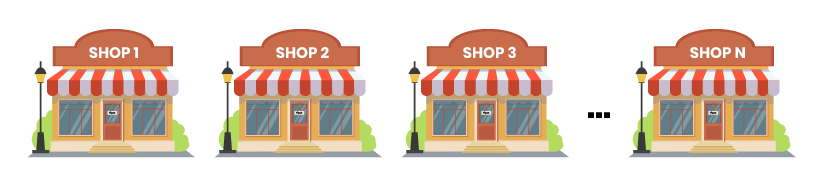
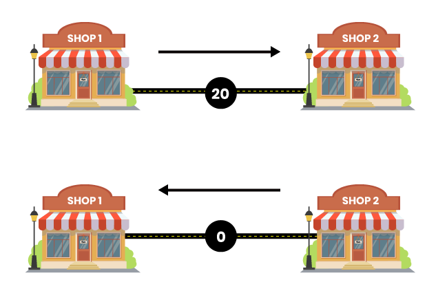
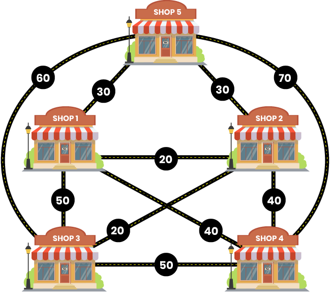
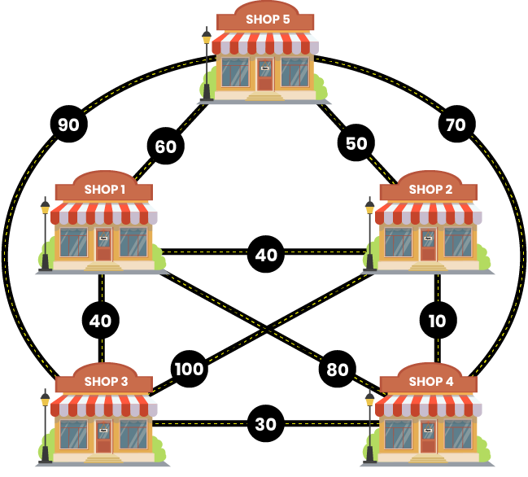

Karn's Travel Cost (100 Marks)

Karn is a rich man and lives in Vice City. He has started a new business of Sports equipment. There are N manufactures shops in the city and Karn want to meet as many as possible as he wishes to maximise his chances of getting good deals. The shops are numbered from 1 to N. The city is constructed in a way that karn can reach any of the other shop from the current shop he is in.

There are P paths between these N Shops. Each of the path carries a cost C to travel. As Karn is rich, he wishes to spend maximum money to visit as many shops as possible. The city has a unique system of cost collection of path travelled. It charges you to travel on it for the first time but if you travel on it again, it does not charge you.

Example:
If Karn travels on a path from Shop 1 to Shop 2, he will be charged cost C. Now, if he travel back to Shop 1 from Shop 2, he will be charged 0.

Karn wants to focus on driving and wants to know the maximum money he would have to spend. Can you tell him the Maximum amount ?

Note: No cycle is allowed.

Input Format
The first line of input consists of number of test cases, T.
The first line of each test case consists of two space separated integers, N and P.
Next P lines consists of three space separated integers, X, Y and C where X and Y represents the shop numbers and indicate a path between the two. C is the cost to travel on the path.

Constraints
1<= T <=10
1<= N <=100000
1<= P <=1000000
1<= C <=1000

Output Format
For each test case, print the required output in a separate line.

Sample TestCase 1
Input

2
5 10
1 2 20
1 3 50
1 4 40
1 5 30
2 3 20
2 4 40
2 5 30
3 4 50
3 5 60
4 5 70
5 10
1 2 40
1 3 40
1 4 80
1 5 60
2 3 100
2 4 10
2 5 50
3 4 30
3 5 90
4 5 70
Output

220
340
Explanation

Test Case 1: 
The maximum money Karn has to spend = 220.

One way of meeting N manufacturers is :
Karn starts from shop 4 and move to shop 2. Cost = 40. He comes back to shop 4. Cost = 0
Karn move to shop 5 from shop 4. Cost = 70
Karn moves from shop 5 to shop 3. Cost = 60
Karn moves from shop 3 to shop 1. Cost = 50

Now, Karn has met with all N manufacturers.

Total Cost = 40 + 70 + 60 + 50 = 220

Test Case 2:
The maximum money Karn has to spend = 340

One way of meeting N manufacturers is :
Karn moves from shop 3 to shop 2. Cost = 100. He comes back to shop 3. Cost = 0
Karn moves from shop 3 to shop 5. Cost = 90
Karn moves from shop 5 to shop 4. Cost = 70
Karn moves from 4 to shop 1. Cost = 80

Now, Karn has met with all N manufacturers.

Total Cost = 100 + 90 + 70 + 80 = 340

Time Limit(X): 
0.50 sec(s) for each input. 

Memory Limit: 
512 MB 

Source Limit: 
100 KB 

Allowed Languages: 
C, C++, C++11, C++14, C#, Java, Java 8, Kotlin, PHP, PHP 7, Python, Python 3, Perl, Ruby, Node Js, Scala, Clojure, Haskell, Lua, Erlang, Swift, VBnet, Js, Objc, Pascal, Go, F#, D, Groovy, Tcl, Ocaml, Smalltalk, Cobol, Racket, Bash, GNU Octave, Rust, Common LISP, R, Julia, Fortran, Ada, Prolog, Icon, Elixir, CoffeeScript, Brainfuck, Pypy, Lolcode, Nim, Picolisp, Pike, pypy3 
